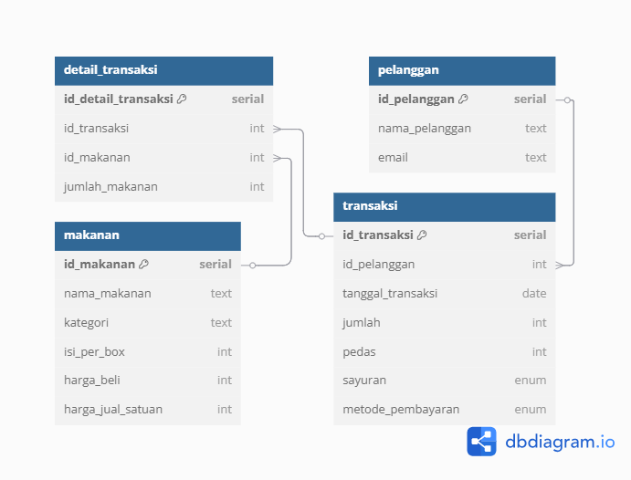

# selamat datang

repo ini cuma skrip yang udah gue jelasin di tiktok gue. yah barang kali mau liat langsung skripnya monggo.

oh iya, kalo nemu repo ini duluan, ini [instagram](https://www.instagram.com/dimawanin_?igsh=azVqZ3ptNG8yYWVr) sama [tiktok](https://www.tiktok.com/@dimawanin_?_t=8jBMyIXcCPa&_r=1) gue kalo mau mampir @dimawanin_

terima kasih..

# database explanation



## Tabel Dimensi

Terdapat dua tabel dimensi dalam database seblak prasmanan.

Tabel pertama adalah pelanggan:

|nama kolom| penjelasan|
|---|---|
|id_pelanggan|primary key|
|nama_lengkap|berisi nama lengkap pelanggan|
|email|berisi email pelanggan|

```sql	
create table pelanggan(
	id_pelanggan int primary key,
	nama_lengkap varchar(50),
	email varchar(50)
);
```

Tabel kedua adalah makanan:

|nama kolom| penjelasan|
|---|---|
|id_makanan|primary key|
|nama_makanan|berisi nama makanan|
|kategori|berisi kategori tiap makanan|
|isi_per_box|berisi jumlah satuan dalam satu box|
|harga_beli|berisi harga beli dalam satu box|
|harga_jual_satuan|berisi harga jual satuan|

```sql
create table makanan(
	id_makanan int primary key,
	nama_makanan varchar(50),
	kategori varchar(50),
	isi_per_box int,
	harga_beli int,
	harga_jual_satuan int
);
```

## Tabel Fakta

Terdapat dua tabel fakta dalam database seblak prasmanan.

Tabel pertama adalah transaksi:

|nama kolom| penjelasan|
|---|---|
|id_transaksi|primary key|
|id_pelanggan|foreign key dari tabel pelanggan|
|tanggal_transaksi|berisi tanggal dilakukannya transaksi|

```sql
create table transaksi(
	id_transaksi int primary key,
	id_pelanggan int references pelanggan(id_pelanggan),
	tanggal_transaksi date,
	pedas int,
	sayuran varchar(50),
	metode_pembayaran varchar(50)
);
```

Tabel kedua adalah detail transaksi:

|nama kolom| penjelasan|
|---|---|
|id_detail_transaksi|primary key|
|id_transaksi|foreign key dari tabel transaksi|
|id_makanan|foreign key dari tabel makanan|
|jumlah|berisi jumlah makanan yang dipesan|

```sql
create table detail_transaksi(
	id_detail_transaksi int primary key,
	id_transaksi int references transaksi(id_transaksi),
	id_makanan int references makanan(id_makanan),
	jumlah int
);
```

## Penjelasan Tabel

Tabel fakta adalah inti dari sebuah database. Tabel ini dibuat untuk merekam log atau transaksi yang dilakukan. Di database ini, tabel transaksi digunakan untuk membuat many to many relationship dari tabel pelanggan ke tabel makanan.

Karena tiap transaksi bisa memesan lebih dari satu makanan, maka dibuat tabel detail transaksi untuk membantu merekam makanan apa saja yang dipesan tiap transaksi.

# full code

```sql
create table pelanggan(
	id_pelanggan int primary key,
	nama_lengkap varchar(50),
	email varchar(50)
);

create table makanan(
	id_makanan int primary key,
	nama_makanan varchar(50),
	kategori varchar(50),
	isi_per_box int,
	harga_beli int,
	harga_jual_satuan int
);

create table transaksi(
	id_transaksi int primary key,
	id_pelanggan int references pelanggan(id_pelanggan),
	tanggal_transaksi date,
	pedas int,
	sayuran varchar(50),
	metode_pembayaran varchar(50)
);

create table detail_transaksi(
	id_detail_transaksi int primary key,
	id_transaksi int references transaksi(id_transaksi),
	id_makanan int references makanan(id_makanan),
	jumlah int
);
```